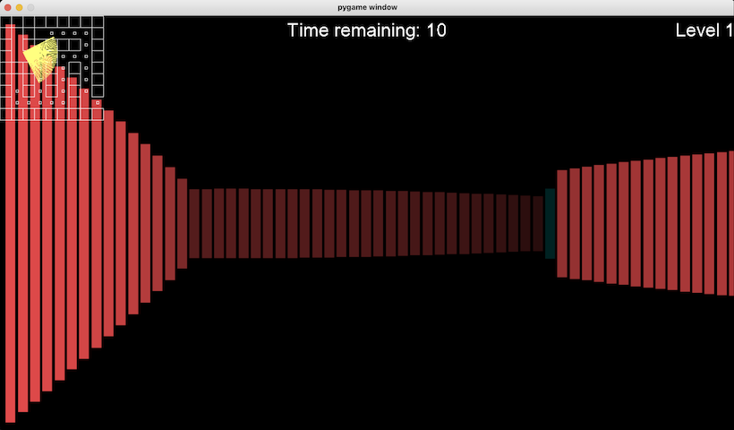

<div align="center">
 <h1>Maze Escape</h1>
 <p><i>A 3D raytracing maze simulation written in python.</i></p>
 
</div>

## Requirements
- This project uses [Python 3](https://www.python.org/download/releases/3.0/), and the [pygame](https://www.pygame.org/wiki/about) library for rendering.
- Installation can be simplified with [homebrew](https://brew.sh/):
```bash
brew install python3
pip install pygame
```
- After that, you can clone the project and navigate to its source directory:
```bash
git clone https://github.com/Camezza/Maze-Escape.git
cd src
```

## Usage
- Everything is configured already, so all you need to do is run the program:
```bash
python3 __main__.py
```

## 

