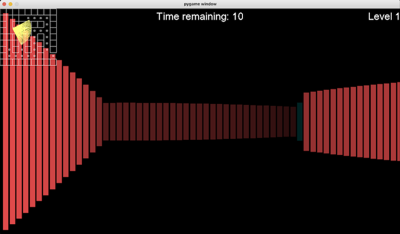
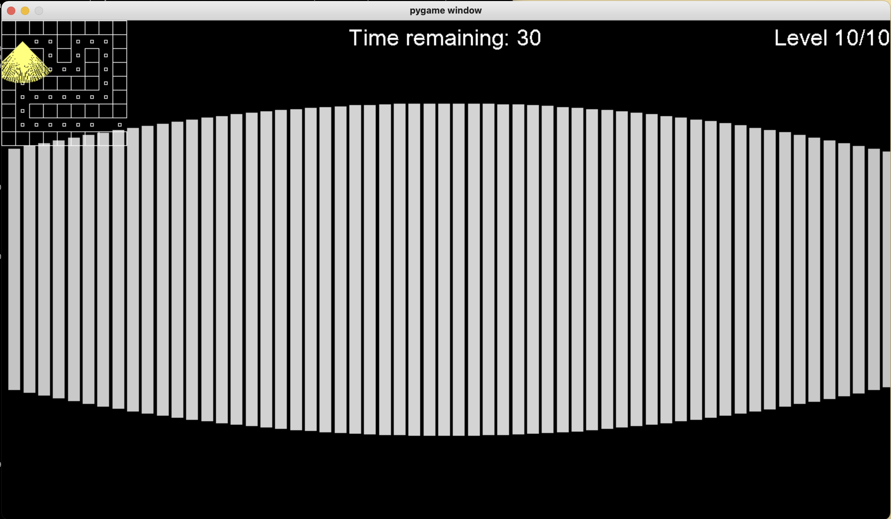
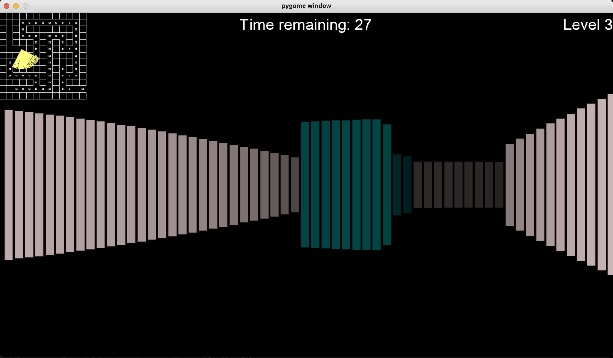
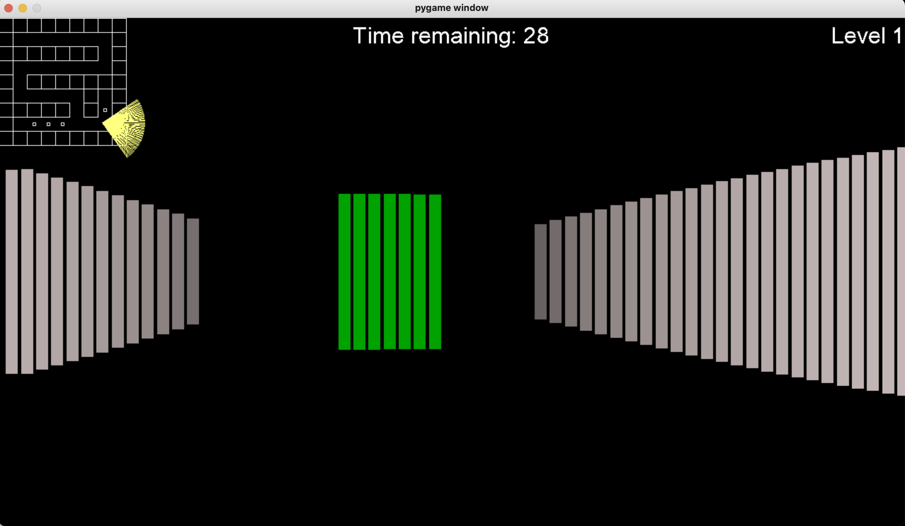
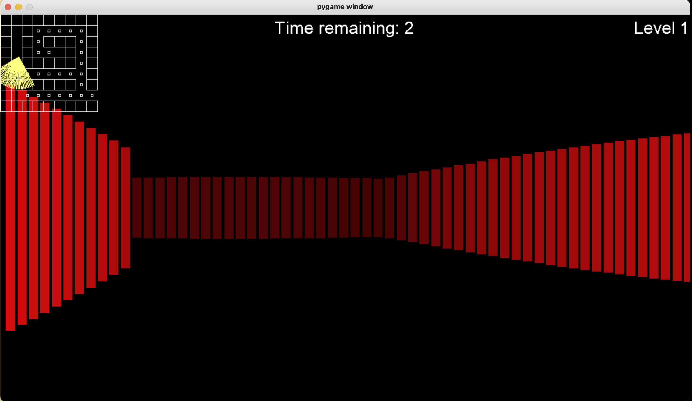

<div align="center">
 <h1>Maze Escape</h1>
 <p><i>A 3D raytracing maze simulation written in python</i></p>
 
 <p><a href="https://vimeo.com/668858354">(Video demo)</a></p>
</div>

# Table of contents
- [Installation](#installation)
- [Usage](#usage)
- [Controls](#controls)
- [How To Play](#objective)
<a name="installation"/>

## Requirements & Installation
- This project uses [Python 3](https://www.python.org/download/releases/3.0/), and the [pygame](https://www.pygame.org/wiki/about) library for rendering.
- Installation can be simplified with [homebrew](https://brew.sh/):
```bash
brew install python3
pip install pygame
```
- After that, you can clone the project and navigate to its source directory:
```bash
git clone https://github.com/Camezza/Maze-Escape.git
cd Maze-Escape/src
```
<a name="usage"/>

## Usage
- Everything is configured already, so all you need to do is run the program:
```bash
python3 __main__.py
```
<a name="controls"/>

## Controls
- Use WASD keys to strafe in cardinal directions.
- Hold SHIFT to sprint.
- Use the ← and → arrow keys to adjust yaw (Look around).
<a name="objective"/>

## How To Play
- You are stuck at the bottom of a mineshaft and are required to climb 10 progressively harder levels to escape.
- Firstly, you will spawn in a setting similar to this:



- Collect diamonds to gain extra time.



- Find the emerald to progress to the next level.



- Keep track of your time. If it runs out, you lose!


